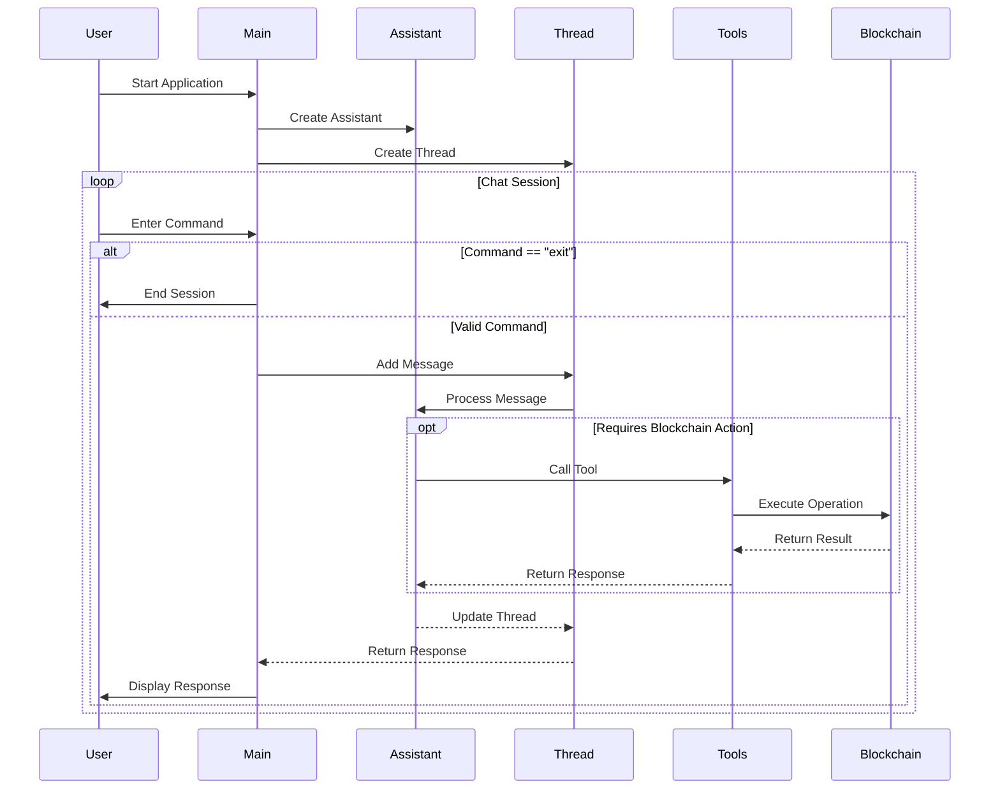

# AgenteX - The Agent framework for [MultiversX](https://multiversx.com/)

## Description

**AgenteX** is a powerful tool designed to interact with MultiversX network following the principles of the [PostWeb by Outlier Ventures](http://postweb.io/). It leverages OpenAI's GPT-4o-mini model to provide a conversational interface for users to perform various blockchain operations, such as checking wallet balances, sending transactions, and more. 
The assistant embodies the persona of anyone, and it can be extender by few steps.

## Features

- **Conversational Interface**: Engage with the assistant to perform blockchain operations through natural language.
- **Wallet Operations**: Check wallet balances, MEX pairs, and retrieve connected wallet addresses.
- **Transaction Management**: Send transactions with customizable parameters.
- **Error Handling**: Robust error handling and feedback for failed operations.

## Getting Started

### Prerequisites

- Node.js (version 14 or higher)
- TypeScript
- OpenAI API key
- Environment variables for wallet private key and other configurations
- A Key file for the wallet
- [MultiversX SDK for TypeScript and JavaScript](https://docs.multiversx.com/sdk-and-tools/sdk-js/)

### Installation

1. Clone the repository:

   ```bash
   git clone https://github.com/nescampos/agentex.git
   cd agentex
   ```

2. Install dependencies:

   ```bash
   bun install
   ```

3. Set up environment variables:
   Create a `.env` file in the root directory and add your OpenAI API key, wallet key file and other information for the network:
   ```plaintext
    OPENAI_API_KEY=************ enter your key here
    WALLET_KEY_FILE= *** the key file for your wallet
    WALLET_PASSWORD=**** the password for the key file
    MULTIVERSX_PROVIDER_URL=*** URL for the MultiversX provider (eg: https://testnet-api.multiversx.com)
    ASSISTANT_NAME=eg: Darth Vader
    CHAIN_ID=T|D|M
   ```

### Usage

To start the assistant, run:

```bash
bun run src/index.ts
```

You can then interact with the assistant in the command line. Type "exit" to end the conversation.

### Tools

The assistant has access to various tools for performing blockchain operations:

#### Read Operations
- **get_balance**: Check wallet balances on the MultiversX network
- **get_wallet_address**: Retrieve the connected wallet's address
- **get_fungible_balance_tokens**: Get the balance of fungible tokens for the wallet.
- **get_nonfungible_balance_tokens**: Get the balance of non fungible tokens for the wallet.
- **get_mex_pairs**: Get the pairs available in MEX.


#### Write Operations
- **send_transaction**: Send transactions with customizable parameters including:
  - Transaction value in EGLD
  - Address.
 
## How to extend

1. Create a new tool in the _tools_ folder.
2. Add the function in the tool.
3. Register the tool in [allTools](./tools/allTools.ts)
4. Update the prompt (**in the prompt file inside the constants folder**) for the assistant to understand when it must run the tool.

## Codebase Flow

The following sequence diagram illustrates the core flow of the application:



### Diagram Explanation

The sequence diagram above shows the interaction flow between different components:

1. **Initialization**:
   - Application starts with creating an OpenAI Assistant
   - A new Thread is created for the conversation

2. **Chat Session Loop**:
   - User enters commands through the CLI
   - Commands are processed through the Thread and Assistant
   - For blockchain operations, specific Tools are called
   - Results are returned through the chain of components

3. **Blockchain Integration**:
   - Tools interface with the blockchain through sdk-js client
   - Operations are executed on the MultiversX network
   - Results are propagated back to the user

4. **Session Management**:
   - Users can exit the application at any time
   - Each command is processed in a sequential manner
   - Responses are displayed back to the user

## Contributing

Contributions are welcome! Please open an issue or submit a pull request for any enhancements or bug fixes.

## License

This project is licensed under the MIT License. See the [LICENSE](LICENSE) file for details.

## Acknowledgments

- OpenAI for providing the GPT-4o-mini model.
- MultiversX Typescript SDK for blockchain interaction utilities.

## Contact

https://x.com/nes_campos 
